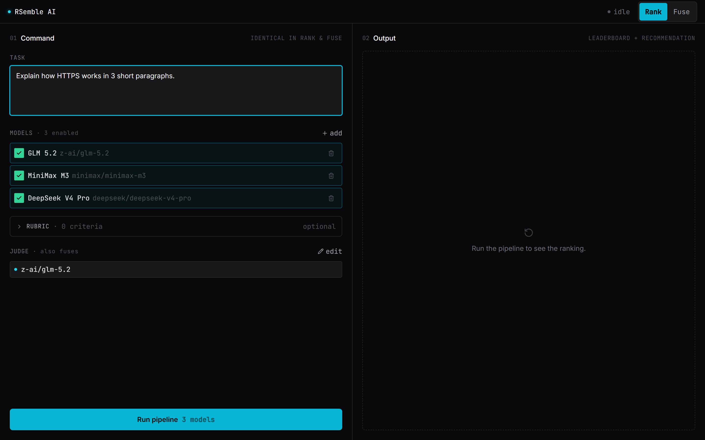

# RSemble AI

Run several AI models on the same task at once, then choose your finish:
**Rank** which one is best, or **Fuse** them into a single answer.

One pipeline, two finish modes — a single toggle decides the outcome per run.

```
Task → Rubric → Compare (N models in parallel) → Judge
                                                       │
                                    ┌─────────────────┴──────────────────┐
                                  RANK                               FUSE
                          "Use this model."                "Here's the merged answer."
```



## When to use

| Scenario | Use RSemble when... |
|----------|---------------------|
| **Model selection** | You need to pick the best model for a *specific* task type — not in general, but for *your* prompt, *your* rubric |
| **Quality assurance** | One model's output isn't trustworthy enough; you want a second (or fifth) opinion |
| **Fusion** | No single model nails it, but the best parts of each could be merged into one stronger answer |
| **Benchmarking** | You want to compare models on your own domain-specific criteria, not public leaderboards |

If you just need a single model's answer fast, use that model directly.
RSemble is for when the *comparison* or *merger* is the point.

## Features

### The run

| Feature | Description |
|---------|-------------|
| Multi-model comparison | Several models generate answers to the same task in parallel |
| Live catalog | Pick models from the live [OpenRouter](https://openrouter.ai) catalog, or type any slug directly — brand-new models work before they're cataloged |
| Rubric-driven judging | Define what "good" means with criteria typed as **goal**, **metric**, or **gap**; the judge scores each candidate and surfaces consensus, contradictions, and unique insights |
| Configurable judge | Set the model that scores candidates and synthesizes fusion — defaults to GLM 5.2, changeable per run |

### Two finishes

| Finish | What you get |
|--------|-------------|
| **Rank** | A leaderboard with tier-colored scores (emerald/cyan/amber), a recommendation callout with the winner, judge consensus/contradiction breakdown cards, and every candidate's full answer rendered as expandable Markdown |
| **Fuse** | One merged answer synthesized from the strongest material across candidates, with each source expandable to see what it contributed |

Rank and Fuse share the same pipeline and fork only at the finish — you can start in
either mode and switch per run without re-running the pipeline.

### The experience

| Feature | Description |
|---------|-------------|
| Live streaming | Watch each model stream token-by-token with a blinking cursor, through three stages: Generating → Judging → Fusing |
| Stage progress | A real-time indicator shows which pipeline stage is active, with a live elapsed timer during judging/fusion |
| Mobile-first responsive | Two-pane workspace on desktop (≥1024px), stacked on tablet (768–1023px), output-first with a command drawer on mobile (<768px) |
| Accessible | Keyboard-navigable radiogroup toggle, focus-visible throughout, `prefers-reduced-motion` aware, ≥44px touch targets |

## Architecture

```
┌─────────────────────────────────────────────────────────┐
│                    Command Pane                          │
│  Task input · Model roster · Rubric · Judge config       │
└──────────────────────────┬──────────────────────────────┘
                           │
                    ┌──────▼──────┐
                    │  RunPipeline │
                    └──────┬──────┘
                           │
         ┌─────────────────▼─────────────────┐
         │         Fanout (parallel)          │
         │  Model A → stream → segments       │
         │  Model B → stream → segments       │
         │  Model C → stream → segments       │
         └─────────────────┬─────────────────┘
                           │
                    ┌──────▼──────┐
                    │    Judge    │  ← rubric + all candidates
                    │  (critic)   │  → scores + consensus breakdown
                    └──────┬──────┘
                           │
              ┌────────────┴────────────┐
              │                         │
       ┌──────▼──────┐          ┌───────▼───────┐
       │    RANK     │          │     FUSE      │
       │  Leaderboard │          │  Merged answer │
       │  + scores    │          │  (synthesizer) │
       └─────────────┘          └───────────────┘
```

**Key state:** Managed by a single `useReducer` in
`studio-engine.ts` with a discriminated-union `Action` type.
Pipeline orchestration (`runFanout` → `runJudge` → `runFusion`)
lives in `rsemble.tsx`.

## Quick start

```bash
npm install
npm run dev
```

Open the printed local URL (default `http://localhost:5173`).

### OpenRouter key

RSemble AI calls real models through [OpenRouter](https://openrouter.ai).

1. Get a key at <https://openrouter.ai/keys>
2. Copy `.env.example` to `.env` and fill in your key:

   ```bash
   cp .env.example .env
   # Edit .env: VITE_OPENROUTER_KEY=sk-or-v1-...
   ```

3. Restart `npm run dev` — Vite reads env vars only at startup.

Without a key the app still loads, shows a banner, and disables live runs.

> **Local/personal use only.** Build-time `VITE_` vars are embedded
> in the client bundle. For a shared deployment, move the OpenRouter
> calls behind a server proxy.

## How a run works

1. **Describe the task** in the command pane.
2. **Enable the models** you want to compare, or add new ones by slug.
3. **Add a rubric** *(optional)* — define criteria as goal, metric, or gap
   types so "good" is explicit for the judge.
4. **Run the pipeline** — candidates stream in as each model generates.
   The stage progress bar shows Generating → Judging → (Fusing).
5. **Finish**: read the **Rank** leaderboard and recommendation,
   or flip to **Fuse** for one merged answer.

## Models

RSemble supports any model available on [OpenRouter](https://openrouter.ai/models).

### Default roster

| Model | Provider | Slug |
|-------|----------|------|
| GLM 5.2 | Z-AI | `z-ai/glm-5.2` |
| MiniMax M3 | MiniMax | `minimax/minimax-m3` |
| DeepSeek V4 Pro | DeepSeek | `deepseek/deepseek-v4-pro` |

### Adding models

Two ways to add a model:

1. **Catalog search** — click "Add a model" and search the live
   OpenRouter catalog. Models you've used before appear first.
2. **Raw slug** — type any valid slug (e.g. `meta-llama/llama-4-maverick`)
   and press Enter. This works even for brand-new models that haven't
   been cataloged yet.

### Judge model

The judge (scorer + synthesizer) defaults to GLM 5.2. Change it via
"Change judge model" in the command pane. Any catalog model works as judge.

## Troubleshooting

| Problem | Fix |
|---------|-----|
| "No OpenRouter API key detected" banner | Create a `.env` file with `VITE_OPENROUTER_KEY=sk-or-v1-...` and restart the dev server |
| Run button stays disabled | Need: (1) API key configured, (2) ≥1 model enabled, (3) non-empty task prompt |
| "Stopped: only N candidate(s) succeeded" | At least 2 models must return successfully to rank or fuse. Check model slugs for typos |
| Judge failed | The judge model may be rate-limited or the response was unparseable. Try a different judge model |
| Fusion failed | Same as judge — the synthesizer model may have errored. Check the error message for details |
| No models in catalog | The catalog loads only when an API key is present. Without a key, add models by slug |

## Tech stack

| Layer | Technology |
|-------|-----------|
| UI | React 18, TypeScript 5 |
| Build | Vite 5 |
| Styling | Tailwind CSS 3 |
| Icons | lucide-react |
| Models | OpenRouter API (streaming + non-streaming) |

## License

See [LICENSE](LICENSE).
