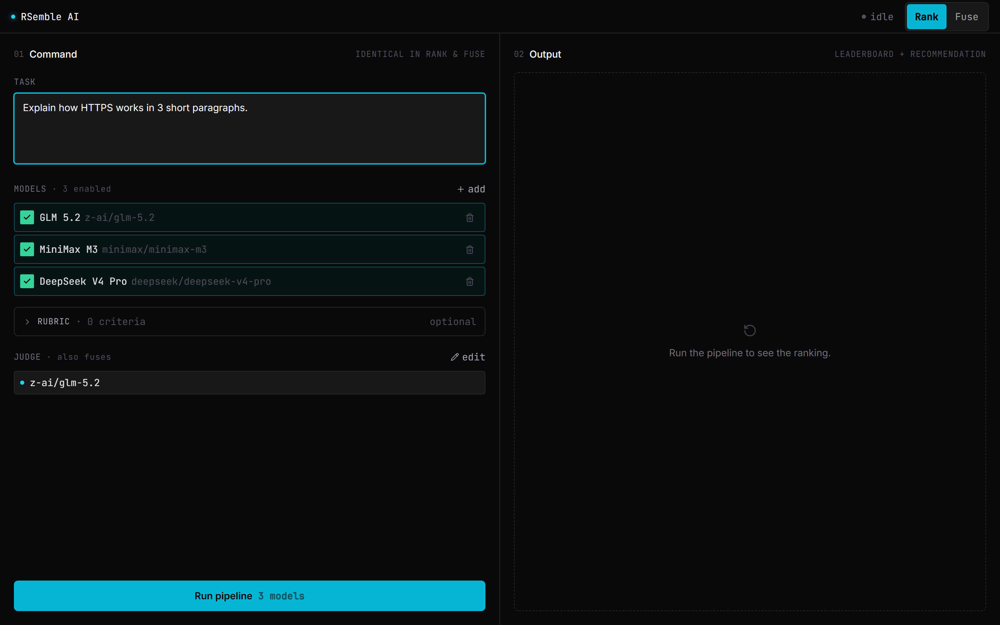

# RSemble AI

Run several AI models on the same task at once, then choose your finish:
**Rank** which one is best, or **Fuse** them into a single answer.

One pipeline, two finish modes — a single toggle decides the outcome per run.

```
Task → Rubric → Compare (N models in parallel) → Judge
                                                       │
                                    ┌─────────────────┴──────────────────┐
                                  RANK                               FUSE
                          "Use this model."                "Here's the merged answer."
```

> Screenshot below is a **historical snapshot** of an earlier single-workspace
> build. The current product has three workspaces (Compare, Runs, Evaluations),
> provider badges on model rows, and the Rank/Fuse toggle in the Compare
> toolbar — see [PRODUCT.md](./PRODUCT.md). It is retained for orientation only.



## Features

**Three workspaces**
- **Compare** — the working surface: one-off fanout → Judge → Rank/Fuse
- **Runs** — durable, searchable run history persisted in browser-local
  IndexedDB (complete snapshots of task, candidates, Judge evidence, scores,
  config, and failures)
- **Evaluations** — versioned local suites of multiple tasks executed through
  the same comparison pipeline, with a model-by-task result matrix

**The run**
- **Multi-model comparison** — several models generate answers to the same task
  in parallel
- **Live catalog** — pick models from a ready provider's catalog, or type any
  native model id directly so brand-new models work before they're cataloged
- **Rubric-driven judging** — define what "good" means; the judge scores each
  candidate blind and surfaces consensus, contradictions, and unique insights
- **Configurable judge** — set the model that scores candidates and synthesizes
  fusion

**Two finishes**
- **Rank** — a leaderboard with tier-colored scores, a recommendation callout,
  and every candidate's full answer rendered as Markdown
- **Fuse** — one merged answer synthesized from the strongest material across
  candidates, with each source expandable to see what it contributed

**The experience**
- **Live pipeline** — watch each model stream token-by-token through
  Generating → Judging → Fusing, and fuse a finished rank run with one click
- **Responsive** — two-pane workspace on desktop, stacked on tablet,
  output-first with a command drawer on mobile
- **Accessible** — keyboard-navigable, focus-visible throughout, reduced-motion
  aware

## Quick start

```bash
npm install
npm run dev
```

Open the printed local URL (default http://localhost:5173).

`npm run dev` starts both the Vite web app and the local Codex bridge. Use
`npm run dev:web-only` for the web app alone, or `npm run dev:bridge` for the
bridge alone.

### Quality gate (for contributors)

```bash
npm run check          # format:check + lint + typechecks + tests + build
npm run format:check   # Prettier
npm run lint           # ESLint (correctness-focused rules)
npm run test:coverage  # Vitest with coverage thresholds
```

See [CONTRIBUTING.md](./CONTRIBUTING.md) for the contribution and release
gates. CI (`.github/workflows/ci.yml`) runs the same commands on a clean
install and needs **no** provider credentials.

## Providers

RSemble AI supports these providers (see [PROVIDERS.md](./PROVIDERS.md) for the
full specification):

| Provider | Transport | Credential |
|---|---|---|
| OpenRouter (`openrouter`) | direct browser | `VITE_OPENROUTER_KEY` |
| ChatGPT subscription via Codex bridge (`chatgpt-codex`) | localhost bridge | Codex CLI login |

> **Codex: experimental integration.** The Codex upstream protocol is not a
> public, stable API. It is isolated behind a `CodexProtocolAdapter` with
> fixture-based compatibility tests; protocol drift surfaces as a distinct
> diagnosis, not a generic network failure. See
> [docs/hardening/codex-compatibility.md](docs/hardening/codex-compatibility.md).
| Gemini AI Studio (`gemini`) | direct browser | `VITE_GEMINI_KEY` |
| DeepSeek (`deepseek`) | direct browser | `VITE_DEEPSEEK_KEY` |
| CommandCode (`commandcode`) | direct browser | `VITE_COMMANDCODE_KEY` |
| ClinePass (`clinepass`) | direct browser | `VITE_CLINEPASS_KEY` |
| Umans (`umans`) | direct browser | `VITE_UMANS_KEY` |
| 9Router (`9router`) | localhost bridge | `VITE_9ROUTER_KEY` (optional) |

Compare requires **at least two enabled candidate slots** before a paid run
starts. A single-model baseline is valid only inside evaluation experiments
where the policy explicitly defines it — there is no general single-model
Compare mode.

### 1. OpenRouter

1. Get a key at [https://openrouter.ai/keys](https://openrouter.ai/keys).
2. Add to `.env`:
   ```bash
   VITE_OPENROUTER_KEY=sk-or-v1-...
   ```

### 2. ChatGPT Subscription (Codex Bridge)

Use your ChatGPT subscription entitlements locally without Platform API key
billing. The Codex integration is **experimental and protocol-sensitive**: the
bridge isolates the upstream protocol so product code never depends on it (see
[PROVIDERS.md §8.2](./PROVIDERS.md)).

1. Authenticate with Codex CLI:
   ```bash
   npx @openai/codex login
   ```
2. Start RSemble with the local bridge:
   ```bash
   npm run dev:bridge
   ```
   *(Or run `npm run dev` to launch Vite and the bridge together.)*
3. The bridge listens on `127.0.0.1:8787` and reads credentials from
   `~/.codex/auth.json` (or `%USERPROFILE%\.codex\auth.json`). Treat
   `auth.json` like a password.

**Troubleshooting:**
- **Bridge unreachable:** Ensure `npm run dev:bridge` is running.
- **Not logged in:** Run `npx @openai/codex login` in terminal and restart bridge.
- **Port 8787 in use:** Set `RSEMBLE_CODEX_BRIDGE_PORT=8788` in `.env` and
  `VITE_CODEX_BRIDGE_URL=http://127.0.0.1:8788`.

### 3. Gemini (Google AI Studio)

1. Get a key at [https://aistudio.google.com](https://aistudio.google.com).
2. Add to `.env`:
   ```bash
   VITE_GEMINI_KEY=AIzaSy...
   ```

### 4. Other providers

DeepSeek, CommandCode, ClinePass, and Umans each take a `VITE_*` key in `.env`
(see `.env.example`). 9Router routes through the local bridge to a
server-configured upstream (`RSEMBLE_9ROUTER_URL`, default
`http://127.0.0.1:20128`); a blank `VITE_9ROUTER_KEY` is valid when 9Router's
`requireApiKey` is disabled.

### Optional bridge authentication

`RSEMBLE_BRIDGE_SECRET` is optional but **enforced when set**: every
credential-bearing bridge endpoint then requires the matching
`X-RSemble-Bridge-Secret` header; `/health` stays public. The web app sources
the same value from `VITE_RSEMBLE_BRIDGE_SECRET`. See
[PROVIDERS.md §8.2.6](./PROVIDERS.md) and [DECISIONS.md #11](./DECISIONS.md).

## Credential policy

> **Local/personal use only.** Build-time `VITE_` vars and the local bridge are
> embedded for local execution; do not expose the app or bridge publicly.

- Environment variables are the **preferred persistent** credential source and
  are read-only in the UI.
- Keys entered in Connections are **session-only by default** (memory until the
  tab exits).
- Persistent browser storage happens only through the explicit **Remember on
  this device** per-key opt-in, and is readable by same-origin JavaScript
  (same-origin/XSS disclosure is shown in the UI).
- Credentials, authorization headers, bridge secrets, and environment contents
  never enter run records, experiment records, logs, archives, exports,
  screenshots, or test fixtures.
- Every provider adapter resolves credentials through one shared
  `CredentialStore`; adapters never read browser storage directly.

See [DECISIONS.md #11](./DECISIONS.md) and [PROVIDERS.md §9.2.1](./PROVIDERS.md).

## `.env` loading

- `VITE_*` variables are embedded into the client bundle **at build time** by
  Vite; changing them requires a rebuild/restart of `npm run dev`.
- `RSEMBLE_*` variables (bridge port, 9Router upstream, bridge secret) are read
  **at runtime** by the Node bridge process.

## How a run works

1. **Describe the task** in the command pane.
2. **Enable the models** you want to compare, or add new ones by id.
3. **Add a rubric** *(optional)* so "good" is explicit for the judge.
4. **Run the pipeline** — candidates stream in as each model generates.
5. **Finish**: read the **Rank** leaderboard and recommendation, or flip to
   **Fuse** for one merged answer.

Rank and Fuse share the same pipeline and fork only at the finish, so you can
start in either mode and switch per run.

### Task attachments

Attach files to the task with the **Attach** button, drag & drop onto the task
field, or paste a screenshot directly (`Ctrl+V`) — every enabled model receives
the same set, so the comparison stays apples-to-apples.

| Kind | Delivered as |
|---|---|
| Image (PNG, JPEG, WebP, GIF) | Native image part — only to models that support vision |
| PDF | Native file part to PDF-capable models; extracted text to the rest |
| Markdown / text / source code / JSON / CSV | Extracted text block |
| `.docx` | Extracted text block |

Limits: **10 files per task, 20 MiB per file, 40 MiB raw total** (one
product-level limit). The local bridge additionally enforces a **64 MiB encoded
body ceiling**; bridge-routed requests run an encoded-size preflight so the UI
never admits a request the transport cannot carry. Files live in the tab's
memory only — nothing is uploaded, and run history stores attachment
names/kinds/sizes as metadata, never content.

Vision gating is explicit, never silent: the capability strip under the task
shows `Vision: X of Y selected models`; models that cannot see images are
auto-disabled at pre-flight, and a run is blocked when fewer than two selected
models can read images. The judge sees extracted text always; native media is
sent to the judge only when small enough (≤ 4 images and ≤ 4 MB, toggleable in
the judge settings).

## Timeouts, errors, and cross-tab coordination

- **Timeouts** are four distinct clocks, not one wall-clock: connect/header
  deadline, stream-inactivity deadline, an optional total execution ceiling,
  and explicit user abort (never reported as a timeout). See
  [PROVIDERS.md §11.1](./PROVIDERS.md).
- **Errors** are reduced to bounded, sanitized categories
  (`CANDIDATE_FAILED`, `JUDGE_FAILED`, `FUSION_FAILED`, timeout kinds, bridge
  auth failures); raw upstream bodies never reach logs or persisted evidence.
- **Cross-tab execution** is coordinated by a persisted execution lease: only
  one tab runs a given execution at a time, with explicit takeover and
  deadline-based recovery. See [PROVIDERS.md §20](./PROVIDERS.md) and
  [DECISIONS.md #11](./DECISIONS.md).

## Loading behavior

RSemble keeps the common **Compare** workflow in the initial bundle and loads
optional heavy surfaces on demand so startup stays fast:

- **Runs, Evaluations, suites, profiles, fusion study, and experiment detail**
  are route-lazy — they load the first time you navigate to them.
- **PDF parsing** (PDF.js) and **`.docx` text extraction** (Mammoth) load only
  when you attach that file type, not on Compare startup. The text/image
  attachment path loads neither parser.
- A **route error boundary** keeps the Compare/execution state alive if a lazy
  chunk fails to load; the view offers Retry instead of resetting the app.

Expected first-use parser delay: a few hundred milliseconds for a PDF/`.docx`
when the parser chunk is fetched for the first time (then cached).

Performance measurement and budget commands are recorded in
[docs/performance/2026-08-plan008-baseline.md](docs/performance/2026-08-plan008-baseline.md).
CI remains owner-managed; the recorded budgets are advisory until an owner-owned
gate is added.

## Tech stack

React 18 · TypeScript · Vite 8 · Tailwind CSS 3 · Vitest 4 · ESLint 9 ·
Prettier 3 · lucide-react
